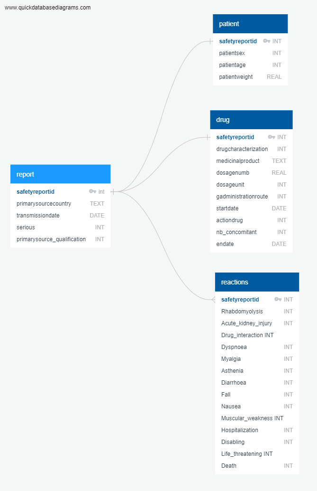
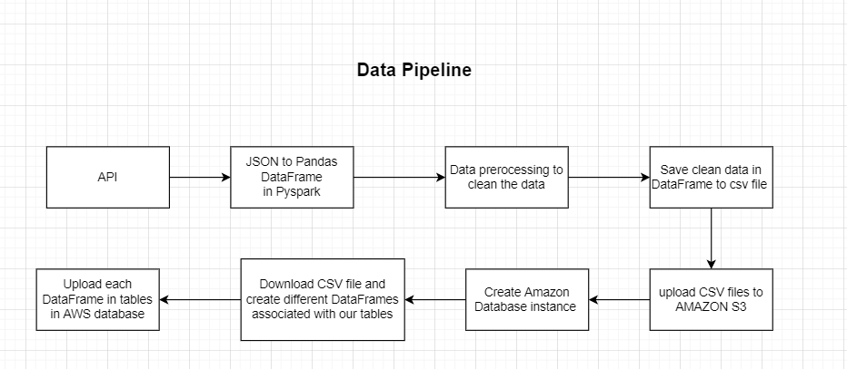
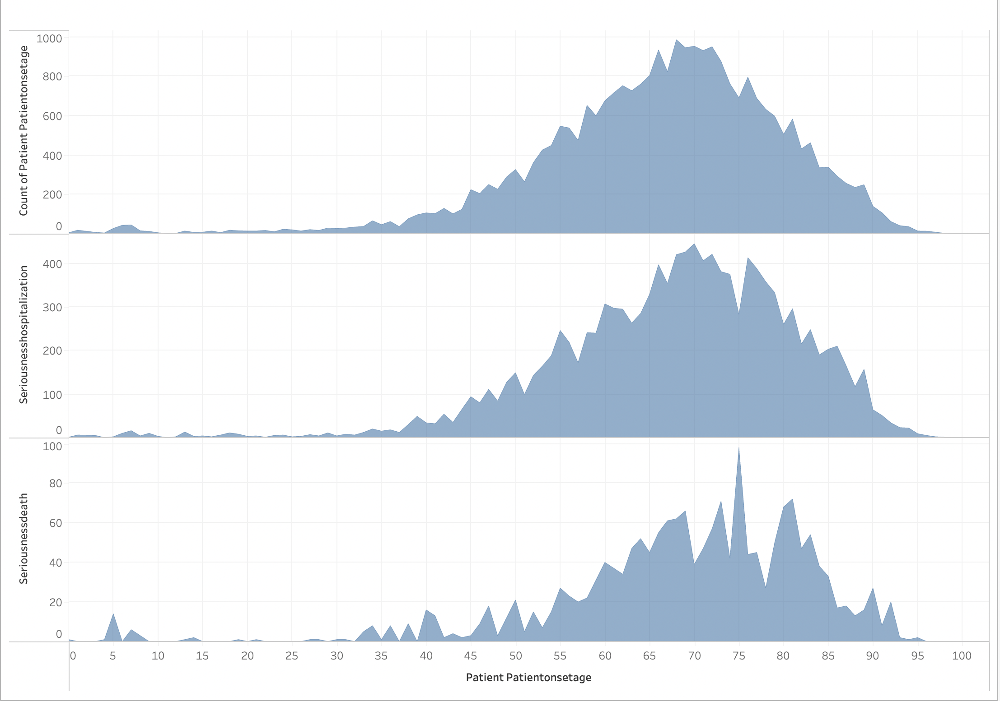
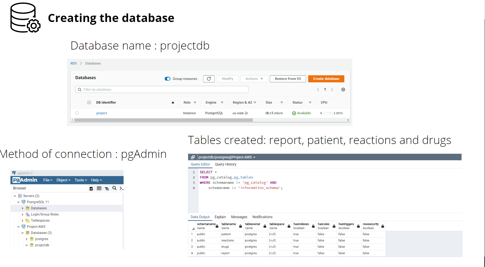
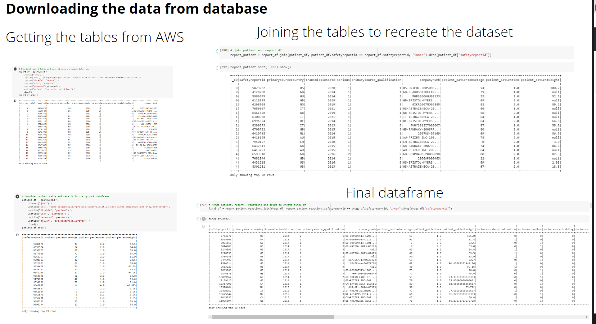

## Presentation

This project will be a supervised machine learning of Classification type. 

### Content

#### Selected topic 
Taking the most prescribed drug class, Statins (Cholesterol lowering medications), leading to hospitatlization and death.


#### Reason why this topic was selected 
To be able to predict the incidences of hospitalisation or death based on an adverse effect dataset from FDA.

We wanted to work with a real-world dataset, and from this data set, we could ask and answer a question about an important question that could be anyone's question and concern, no matter where in the world they live or what in the world they do. 

#### Description of the source of data 
This is a dataset provided by the FDA based upon submissions by medical professionals about medications and their effect (adverse effect) on those who take them.
It is important to mention that our datasource is limited to the reported cases.

#### Questions the team hope to answer with the data
The question to answer is the likelihood of getting hospitalised or dying if experiencing any side effects by taking this medication. Using a supervised machine learning classificaion method, we want to be able to predict, -by looking at the age, gender, adverse reactions, drug indication- whether the patient will have serious reactions to Atorvastatin leading to  hospitalisation or not and whether they will have very serious reactions that may cause death or not. 


#### Database Mock Up (Preferably a ERD - Entity Relationship Diagram)


#### Diagram of Data Pipeline (ETL, Database, and Machine Learning model)



#### Description of the data exploration phase of the project

While exploring the data, we realized that some of the fields have many missing values, such as patient's weight, some of the fields' categorical data have about 500 different unique values, and some are obviously have input mistakes. If we wanted to drop all the missing values blindly, we would have been left with a relatively small dataset to work with and not enough data to be able to train our machine learning models and hope to get a higher performance model able to make predictions with the desired level of accuracy.

To fix the missing numerical values issue, we decided to use some of the existing methods to fill some of the missing values, in this case we used Iterative Imputing, that uses a function to predict the missing values based on the existing values and other features.

The approach we took for the categorical data with numerous unique values, was to group them depending on their values. with this approach we were able to bring down the number of unique values to about 16 categories and then encode them into numerical features using (oneHotEncoder)

The fields were data had obvious input mistake, we corrected the issue with pandas replace method.

Taking advantage of these methods helped us save a healthy percentage of our original dataset, while giving us confidence that we stayed true to the original dataset.

Example of regrouping in order to decrease the number of categorical data (in this case countries):

```
ctydict = df['primarysourcecountry'].value_counts().to_dict()
for c in ctydict:
  if ctydict[c] <= 300:
    df['primarysourcecountry'] = df['primarysourcecountry'].replace(c,"Other")

df['primarysourcecountry'].value_counts()
```

#### Description of the analysis phase of the project

After the preprocessing of our data, we decided on our features and targets for the machine learning portion of our project and were able to fit different ML models with our train data set and then test our models for performance and accuracy. 

This task was split between all the team members and each of us worked on different ML models, comprising of the less complex models such as Logistic Regression model and more complex ones such as Neural Network's deep learning models.

After extracting a classification report and accuracy score for each of our models, we realized that the model that is giving us the best results for predicting death and hospitalisation (taking into account precision and recall and other metrics) is Random Forest with Balanced subsample.

The results of some of the models we tried are here:

- Logistic Regression


- Random Forest Balanced


- SVM


- Neural Network 


#### Technologies, languages, tools, and algorithms used throughout the project
* Data in the format of JSON retrieved from FDA Website using API, then converted to CSV, then stored to Amazon S3
* Python files to run on Google Colab will be using Pandas and PySpark libraries.
* The cleaned data will be loaded in a PostgreSQL on AWS.
* Data will be processed with a superised machine learning model potentially Neural Networks.
* Presentation Slides on Google Slides.
* For visualisation, we will have an interactive Tableau dashboard.

#### Visualization Blueprint
This is a visualization about statins in general:





#### Database Connection






### Link to our code:
[Code](https://colab.research.google.com/drive/1OnK27kfFz05AUs3EIdkArZ_w93yHvBJA?usp=sharing "Code")

### Link to the Google Slide Presentation:
[Presentation](https://docs.google.com/presentation/d/1gpLId618DzodGrncwFsHKa1xZkDsZFZXl6Yh6Q-xEaQ/edit#slide=id.p1 "Presentation Link")