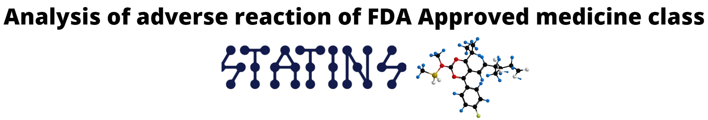
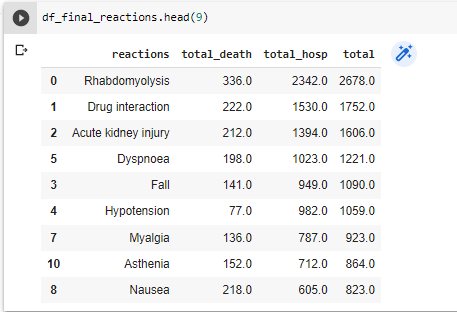
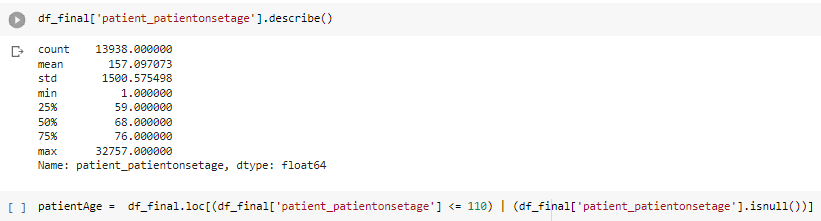
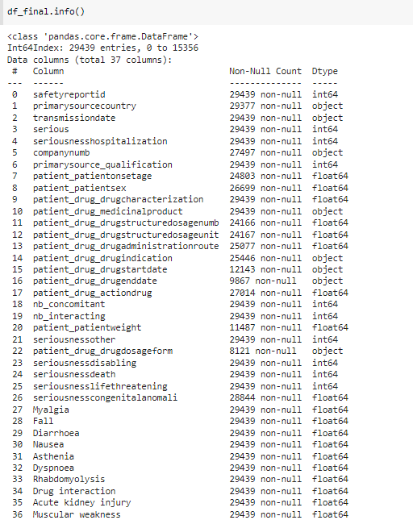
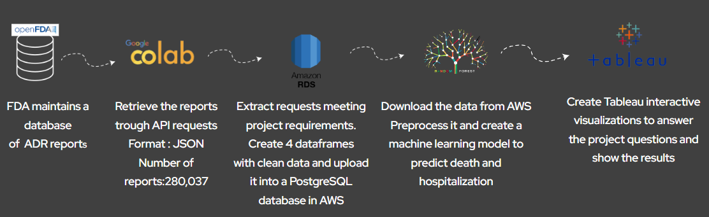
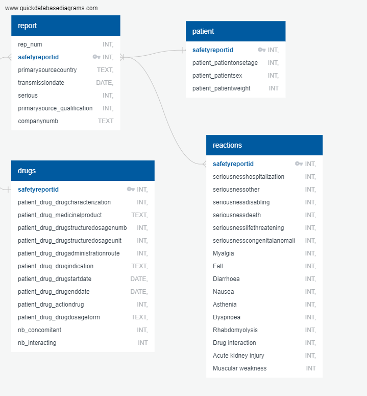
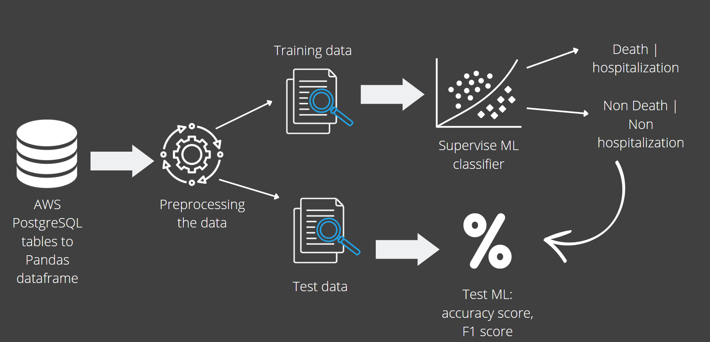
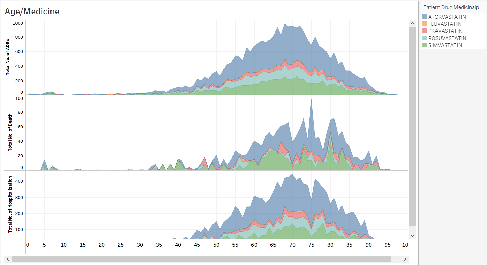
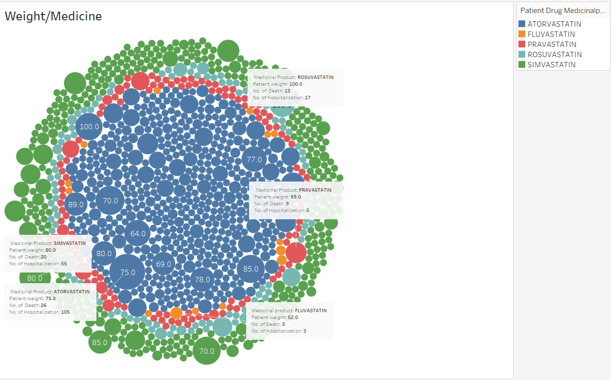
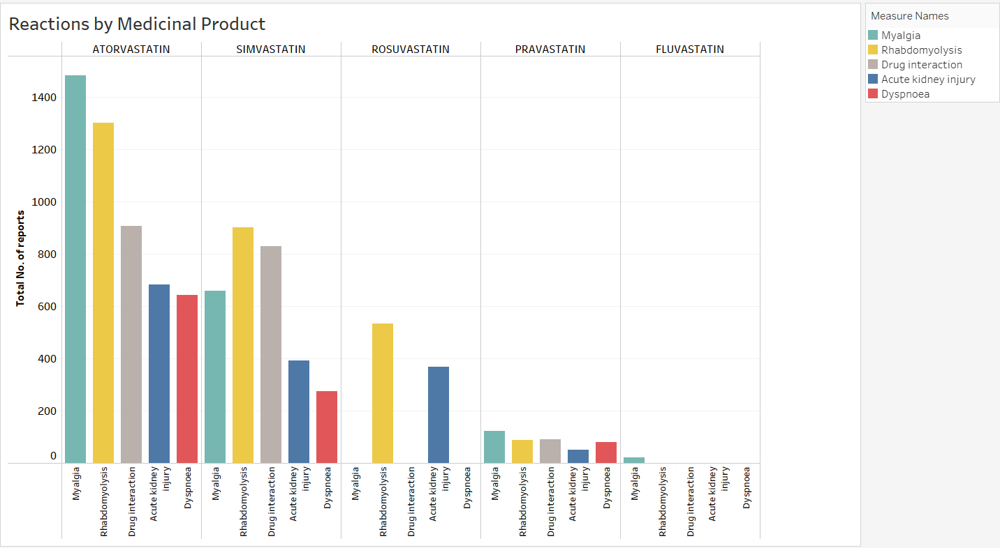

## Presentation

Adverse drug events (ADEs) are defined as injuries resulting from medication use. Adverse reporting data have proven to be useful evidence in predicting adverse drug effects and flagging potential safety issues. 
Taking one the most prescribed class of drugs, statins, we used FDA adverse reporting data to analyze their potential adverse reactions and predict the most undesirable ones!


## Content

### Selected topic 
The most prescribed drug class, Statins (Cholesterol lowering medications), leading to hospitatlization and death.

We considered the following statins:

* [Atorvastatin (Lipitor®)](https://en.wikipedia.org/wiki/Atorvastatin)
* [Fluvastatin (Lescol. ®)](https://en.wikipedia.org/wiki/Fluvastatin)
* [Pravastatin (Pravachol®)](https://en.wikipedia.org/wiki/Pravastatin)
* [Rosuvastatin (Crestor®)](https://en.wikipedia.org/wiki/Rosuvastatin)
* [Simvastatin (Zocor®)](https://en.wikipedia.org/wiki/Simvastatin)

### Reason why this topic was selected 
* Annual cost of drug-related morbidity and mortality: ~ 170 billion dollars and rising [reference](https://www.sciencedirect.com/science/article/abs/pii/S1086580216312293?via%3Dihub)

* Around 1.9 millions emergency room visits in USA related to ADRs [reference](https://www.hcup-us.ahrq.gov/reports/statbriefs/sb109.pdf)

* We wanted to work with a real-world dataset, and using this data set, we could ask and answer questions about an important issue that could be anyone's concern.


### Description of the source of data 
This is a dataset provided by the FDA based upon submissions by medical professionals about medications and their reactions (adverse reactions) on those who take them.
It is important to mention that our datasource is limited to the reported cases.

The data collected by FDA is available through their API or CSV files. Using the API data, which has been streamlined to remove duplicate records, we created our dataset. 

Example of API query used:

```
https://api.fda.gov/drug/event.json?search=(patient.drug.openfda.generic_name:'atorvastatin'+patient.drug.openfda.brand_name:'atorvastatin'+patient.drug.medicinalproduct:'atorvastatin')+AND+_exists_:patient.drug.drugstructuredosageunit+AND+_exists_:patient.drug.drugstructuredosagenumb+AND+(primarysource.qualification:1+primarysource.qualification:2+primarysource.qualification:3
```

[API URL](https://api.fda.gov/drug/event.json?search=(patient.drug.openfda.generic_name:'atorvastatin'+patient.drug.openfda.brand_name:'atorvastatin'+patient.drug.medicinalproduct:'atorvastatin')+AND+_exists_:patient.drug.drugstructuredosageunit+AND+_exists_:patient.drug.drugstructuredosagenumb+AND+(primarysource.qualification:1+primarysource.qualification:2+primarysource.qualification:3))

Anatomy of response in JSON format:
```
{
safetyreportversion: "1",
safetyreportid: "10004470",
primarysourcecountry: "JP",
occurcountry: "JP",
transmissiondateformat: "102",
transmissiondate: "20141002",
reporttype: "1",
serious: "1",
seriousnessother: "1",
patient: {
patientonsetage: "77",
patientonsetageunit: "801",
patientsex: "2",
reaction: [
{
reactionmeddraversionpt: "17.0",
reactionmeddrapt: "Blood potassium decreased",
reactionoutcome: "6"
},
],
drug: [
{
….
drugcharacterization: "1",
medicinalproduct: "LIPITOR",
drugauthorizationnumb: "020702",
drugdosagetext: "10 MG TABLET",],
generic_name: [
"ATORVASTATIN CALCIUM"
],
route: [
"ORAL"
],
}
```


### Questions the team hope to answer with the data
* Questions we want to answer trough analysis and visualizations with Tableau:
	* What are the most common and severe reactions of Statins
	* Is there a difference in developping adverse reactions among genders
	* What reactions are most associated with death and hospitalization
	
* Question we want to answer using a supervised machine learning classificaion model:
	* Likelihood of getting hospitalised or dying if experiencing some adverse reactions by looking at the age, gender, adverse reactions, drug indication.

### Downloading and cleaning the data from OpenFDA
For all the statins considered: Atorvastatin, Fluvastatin, Simvastatin, Pravastatin, and Rosuvastatin, we were able to download 280,037 records in 29 requests.

Some additional cleaning was necessary to consolidate relevant data from the reports we obtained. Therefore, we went through the following steps to clean the data:

* Before preparing the data for prediction and visualization, we cleaned the JSON results from the API, removing 52 fields and their values as many contain non-essential information for our analyses. 

* We dropped all reports that do not have a statin as the suspected drugs of the reactions experienced.

* We used the information from some variables to create two new features considered essential for predicting death and hospitalization: 
	* "nb_concomitant": the number of concomitant drugs the person was taking with the statin
	* "nb_interacting": the number of interacting drugs the person was taking with the statin

* We replaced NAN values in columns where the default value should be 0 according to openFDA indication: 
	* serious, 
	* seriousnessother
	* seriousnessdisabling
	* seriousnessdeath 
	* seriousnesslifethreatening
	* seriousnesscongenitalanomali 

* Since a report can contain several reactions ranging from 1 to 35, and some reactions can only occur in one report, we created a list of the ten most common and severe reactions to keep. 



* We make sure that some variables such as age and weight do not contain outliers




After cleaning the dataset, we have left 29439 reports with 36 variables:




### Data Pipeline



### Database Implementation

#### ERD Diagram



With the cleaned dataset, we created 4 dataframes: report, patient, reactions and drugs that contain the information we uploaded in 4 tables in a AWS PostgreSQL database.


Then, before starting our analyses and creating our machine learning model, we downloaded each table and join them in a dataframe to be preprocessed.


### Description of the data exploration phase of the project

While exploring the data, we realized that some of the fields have many missing values, such as patient's weight, some of the fields' categorical data have about 500 different unique values, and some have obvious input mistakes. If we wanted to drop all the missing values blindly, we would have been left with a relatively small dataset to work with and not enough data to be able to train our machine learning models efficiently and get a high performance model capable of making predictions with the desired level of accuracy.

To fix the missing numerical values issue, we decided to use some of the existing methods to fill some of the missing values, in this case we used Iterative Imputing, that uses a function to predict the missing values based on the existing values and other features.

The approach we took for the categorical data with numerous unique values, was to group them depending on their values. Using this approach we were able to bring down the number of unique values to about 16 categories and then encode them into numerical features using (oneHotEncoder)

The fields where data had obvious input mistake, we corrected the issue with pandas replace method.

Taking advantage of these methods helped us save a healthy percentage of our original dataset, while giving us confidence that we stayed true to the original dataset.

Example of regrouping in order to decrease the number of categorical data (in this case countries):

```
ctydict = df['primarysourcecountry'].value_counts().to_dict()
for c in ctydict:
  if ctydict[c] <= 300:
    df['primarysourcecountry'] = df['primarysourcecountry'].replace(c,"Other")

df['primarysourcecountry'].value_counts()
```

Example of filling missing values (in this case patient's weight) using Iterative Imputing:

```
weight_imputer = IterativeImputer(random_state=42)
df['patient_patientweight'] = weight_imputer.fit_transform(df[['patient_patientweight']])
```

Example of filling missing values
```
# Fill missing values from seriousnesscongenitalanomali with 0 since if someone does not have congenital anomali, the value is supposed to be 0
df['seriousnesscongenitalanomali'].fillna(0,inplace=True)
```

Example of grouping values to decrease the number of categorical data (in this case drug indications)
```
covid_related_indications = ['COVID-19 PNEUMONIA','COVID-19 immunisation','COVID','COVID-19']
for i in covid_related_indications:
  df['patient_drug_drugindication'] = df['patient_drug_drugindication'].apply(
    lambda row : "COVID" if str(row) == i else row
    )
```

### Description of the analysis phase of the project

#### Machine learning diagram



After the preprocessing of our data, we decided on our features and targets for the machine learning portion of our project, and then were able to fit different ML models with our train data set and then test our models for performance and accuracy. 

This task was split between all the team members and each of us worked on different ML models, comprising of the less complex models such as Logistic Regression model and more complex ones such as Neural Network's deep learning models.

After extracting a classification report and accuracy score for each of our models, we realized that the model that is giving us the best results for predicting death and hospitalisation (taking into account precision and recall and other metrics) is Random Forest with Balanced subsample.

Some of the models we tried listed here (not limited to):

- Logistic Regression
- Random Forest (Balanced Subset)
- Support Vector Machines (SVM)
- Neural Networks (Deep Learning)

And their results:


### Visualization 

To answer the questions of our project rergarding statins, we used visual elements like charts, graphs, and maps to find trends, outliers, and patterns in our dataset.

#### Statins and age



* The age trend follows that of an older population.

* Instances of adverse reactions and hospitalizations begin to become significant at around age 40 and peak at around age 70.

* Instances of death peak at around age 75, which is in line with average life expectancy.


#### Statins and weight



* The highest incidence of adverse reactions occurs in people weighing 80kg, the average weight of a North American. 

* There are more instances above this weight than below, which suggests a higher instance of adverse reactions in those of above average weight.


#### Statins most common reactions



* The most common ADR associated with Atorvastatin is Myalgia.

* The most common ADR associated with Simvastatin and Rosuvastatin is Rhabdomyolysis. 

* As rhabdomyolysis a more serious condition than myalgia, this could be a reason that Simvastatin and Rosuvastatin are prescribed less than Atorvastatin


### Technologies, languages, tools, and algorithms used throughout the project
* Data in JSON format retrieved from FDA API, then converted to CSV, then stored to Amazon S3
* Python files to run on Google Colab using Pandas and PySpark libraries.
* The cleaned data was loaded in a PostgreSQL database on AWS.
* The cleaned data was processed and used for prediction applying a superised machine learning model from scikit-learn python library.
* Presentation Slides on Google Slides.
* For visualisation, we have used Tableau public and have stories and interactive dashboards.

### Result of analysis
We came up with a couple of interpretations of the analysis:

***- Gender Differences***

Overall, there were more reports of men having adverse reactions than women. This could mean more men being prescribed statins, or men being more susceptible to adverse reactions from the use of statins. Most likely it is a combination of both. We could further explore this by obtaining overall usage statistics of statins over the same time period.

Women experiencing adverse effects from statins had a slightly higher rate of hospitalization than men, with men having a 44.9% chance of being hospitalized compared to 45.5% of women. 
	
Men had a significantly higher instance of death than women. Women who experienced adverse reactions from statins had a 5.0% chance of death, whereas men had a death rate of 7.6%.


***- Age and Weight Differences***

The age trend seems to follow that of an older population. Instances of adverse reactions and hospitalizations begin to become significant at around age 40 and peak at around age 70. Instances of death peak at around age 75, which is in line with average life expectancy.

Weight trends seem to follow that of an adult population. The highest incidence of adverse effects occurs in people weighing 80kg, which is the average weight of a North American. There are more instances above this weight than below, which suggests a higher instance of adverse reactions in those of above average weight.
	
What we can interpret from this is that statins are mainly prescribed to people above the age of 40, and that instances of side effects increase as people approach the age of 70. We can also interpret that while weight will not necessarily determine whether someone will have an adverse reaction, weighing 80kg or more will increase the likelihood of these reactions.


***- Differences between Medicinal Products***

The five medicinal products showed some key differences, mainly the prevalence of the use of Atorvastatin. More than half of all reported adverse effects occurred in patients taking Atorvastatin. Simvastatin and Rosuvastatin have the second and third most instances of adverse reactions respectively, making up the majority of the remainder of reports.

The most common side effect associated with Atorvastatin is Myalgia. Interestingly, the most common side effect associated with Simvastatin and Rosuvastatin is Rhabdomyolysis. As this is generally a more serious condition than myalgia, this could be a reason that Simvastatin and Rosuvastatin are prescribed less than Atorvastatin.

### Next steps
---

### Deployment of ML Model

* Create a website (eg. Flask) that allows user inputs that can be run against a trained model. 

* Once deployed, a doctor or other medical practitioner could input the necessary patient data into the model to determine the risk of hospitalization or death due to an adverse reaction to a statin. 

* This could help to inform the decision making process when prescribing statins and could potentially reduce instances of negative outcomes from adverse reactions.

### Recommendation for future analysis
* Obtaining the overall prescription data for statins would greatly increase the usefulness of our model. We could create models that predict hospitalization or death for any patient that has a statin prescribed to them.

* Finding patterns between the features on a bigger dataset.

### Anything the team would have done differently
* We could have created a new feature using the enddate and startdate columns that gave us the duration the drug was taken.


### Link to our code:
[Code](https://colab.research.google.com/drive/1LrUOWOIpUT1uyY8crzlcWn63_xM5D8aK?usp=sharing "Code")

### Link to the Google Slide Presentation:
[Presentation](https://docs.google.com/presentation/d/1bK3ao6vfF4t49wK90f4OfuiG8FiLDsfocsHALQ5w8JE/edit?usp=sharing "Presentation Link")

### Link to the Tableau Public Dashboard:
[Dashboard](https://public.tableau.com/views/Group10Project_16598908439690/HomePage?:language=en-US&:display_count=n&:origin=viz_share_link "Dashboard Link")

#### Project done by this team (alphabetically ordered):
- Baldassarre, Nick - [GitHub](https://github.com/NickBaldassarre "GitHub")
- Farahani, Tina - [GitHub](https://github.com/Tifarahani "GitHub") 
- Leonard, Valerie - [GitHub](https://github.com/valerielnd "GitHub")
- Mostaghimi, Tannaz - [GitHub](https://github.com/tannazmo "GitHub")
