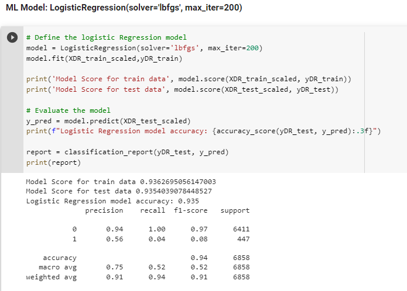
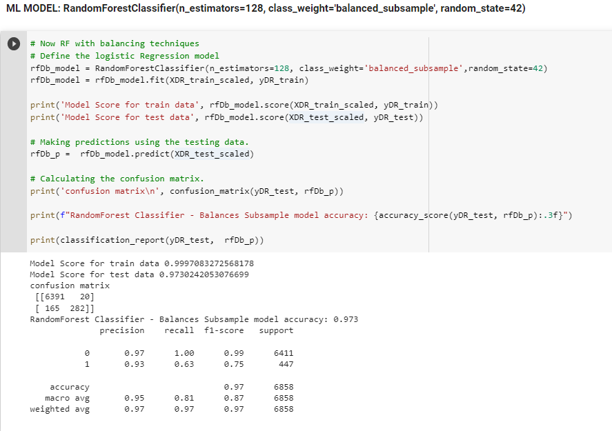
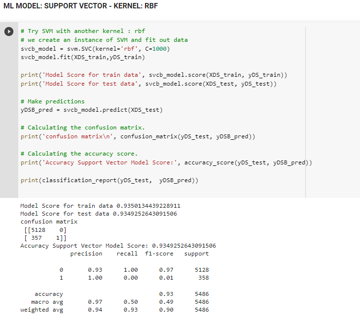
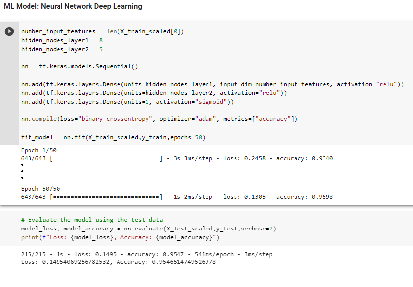

## Presentation

Adverse drug events (ADEs) are defined as injuries resulting from medication use. Adverse reporting data have proven to be useful evidence in predicting adverse drug effects and flagging potential safety issues. 
Taking one the most prescribed class of drugs, statins, we used FDA adverse reporting data to analyze their potential adverse reactions and predict the most undesirable ones!


### Content

#### Selected topic 
The most prescribed drug class, Statins (Cholesterol lowering medications), leading to hospitatlization and death.

We considered the following statins:

* [Atorvastatin (Lipitor®)](https://en.wikipedia.org/wiki/Atorvastatin)
* [Fluvastatin (Lescol. ®)](https://en.wikipedia.org/wiki/Fluvastatin)
* [Pravastatin (Pravachol®)](https://en.wikipedia.org/wiki/Pravastatin)
* [Rosuvastatin (Crestor®)](https://en.wikipedia.org/wiki/Rosuvastatin)
* [Simvastatin (Zocor®)](https://en.wikipedia.org/wiki/Simvastatin)


#### Reason why this topic was selected 
* Annual cost of drug-related morbidity and mortality: ~ 170 billion dollars and rising [reference](https://www.sciencedirect.com/science/article/abs/pii/S1086580216312293?via%3Dihub)

* Around 1.9 millions emergency room visits in USA related to ADRs [reference](https://www.hcup-us.ahrq.gov/reports/statbriefs/sb109.pdf)

* We wanted to work with a real-world dataset, and using this data set, we could ask and answer questions about an important issue that could be anyone's concern.

#### Description of the source of data 
This is a dataset provided by the FDA based upon submissions by medical professionals about medications and their effect (adverse effect) on those who take them.
It is important to mention that our datasource is limited to the reported cases.

The data collected by FDA is available through their API or CSV files. Using the API data, which has been streamlined to remove duplicate records, we created our dataset. 

Example of API query used:

[API URL](https://api.fda.gov/drug/event.json?search=(patient.drug.openfda.generic_name:'atorvastatin'+patient.drug.openfda.brand_name:'atorvastatin'+patient.drug.medicinalproduct:'atorvastatin')+AND+_exists_:patient.drug.drugstructuredosageunit+AND+_exists_:patient.drug.drugstructuredosagenumb+AND+(primarysource.qualification:1+primarysource.qualification:2+primarysource.qualification:3))

Anatomy of response in JSON format:
```
{
safetyreportversion: "1",
safetyreportid: "10004470",
primarysourcecountry: "JP",
occurcountry: "JP",
transmissiondateformat: "102",
transmissiondate: "20141002",
reporttype: "1",
serious: "1",
seriousnessother: "1",
patient: {
patientonsetage: "77",
patientonsetageunit: "801",
patientsex: "2",
reaction: [
{
reactionmeddraversionpt: "17.0",
reactionmeddrapt: "Blood potassium decreased",
reactionoutcome: "6"
},
],
drug: [
{
….
drugcharacterization: "1",
medicinalproduct: "LIPITOR",
drugauthorizationnumb: "020702",
drugdosagetext: "10 MG TABLET",],
generic_name: [
"ATORVASTATIN CALCIUM"
],
route: [
"ORAL"
],
}
```


#### Questions the team hope to answer with the data
* Questions we want to answer trough analysis and visualization with Tableau:
	* What are the most common and severe reactions of Statins
	* Is there a difference in developping adverse reactions among genders
	* What reactions are most associated with death and hospitalization
	
* Question we want to answer using a supervised machine learning classificaion method:
	* Likelihood of getting hospitalised or dying if experiencing some adverse reactions by looking at the age, gender, adverse reactions, drug indication.


#### Downloading and cleaning the data from OpenFDA
For all the statins considered: Atorvastatin, Fluvastatin, Simvastatin, Pravastatin, and Rosuvastatin, we were able to download 280,037 records.

Some additional cleaning was necessary to consolidate relevant data from the reports we obtained. Therefore, we went through the following steps to clean the data:

* As a report can have up to 100 fields, and many of them contain non-essential information for our analyses, before preprocessing the data 
for prediction and visualization, we cleaned the JSON results from the API to remove 52 fields and their values.

* We drop all reports that do not have a statin as the suspected drugs of the reactions experienced.

* We collected the information from some variables to create two new features considered essential for predicting death and hospitalization: 
	* "nb_concomitant": the number of concomitant drugs the person was taking with the statin
	* "nb_interacting": the number of interacting drugs the person was taking with the statin

* We replaced NAN values in columns where the default value should be 0 according to openFDA indication: 
	* serious, 
	* seriousnessother
	* seriousnessdisabling
	* seriousnessdeath 
	* seriousnesslifethreatening
	* seriousnesscongenitalanomali 

* As a report can have several reactions ranging from 1 to 35, and some of them can only appear in a single report, we 
created a list of 10 reactions to keep based on the most common and severe reported ones.


* We make sure that some variables such as age and weight do not contain outliers


After cleaning the dataset, we have left 29439 reports with 36 variables:


#### Data Pipeline


#### Database Implementation

##### ERD Diagram


With the cleaned dataset, we created 4 dataframes: report, patient, reactions and drugs that contain the information we uploaded in 4 tables in a AWS PostgreSQL database.


Then, before starting our analyses and create our machine learning model, we downloaded each table and join them in a dataframe to be preprocessed.


#### Description of the data exploration phase of the project

While exploring the data, we realized that some of the fields have many missing values, such as patient's weight, some of the fields' categorical data have about 500 different unique values, and some are obviously have input mistakes. If we wanted to drop all the missing values blindly, we would have been left with a relatively small dataset to work with and not enough data to be able to train our machine learning models and hope to get a higher performance model able to make predictions with the desired level of accuracy.

To fix the missing numerical values issue, we decided to use some of the existing methods to fill some of the missing values, in this case we used Iterative Imputing, that uses a function to predict the missing values based on the existing values and other features.

The approach we took for the categorical data with numerous unique values, was to group them depending on their values. with this approach we were able to bring down the number of unique values to about 16 categories and then encode them into numerical features using (oneHotEncoder)

The fields were data had obvious input mistake, we corrected the issue with pandas replace method.

Taking advantage of these methods helped us save a healthy percentage of our original dataset, while giving us confidence that we stayed true to the original dataset.

Example of regrouping in order to decrease the number of categorical data (in this case countries):

```
ctydict = df['primarysourcecountry'].value_counts().to_dict()
for c in ctydict:
  if ctydict[c] <= 300:
    df['primarysourcecountry'] = df['primarysourcecountry'].replace(c,"Other")

df['primarysourcecountry'].value_counts()
```

#### Description of the analysis phase of the project

##### Machine learning diagram


After the preprocessing of our data, we decided on our features and targets for the machine learning portion of our project and were able to fit different ML models with our train data set and then test our models for performance and accuracy. 

This task was split between all the team members and each of us worked on different ML models, comprising of the less complex models such as Logistic Regression model and more complex ones such as Neural Network's deep learning models.

After extracting a classification report and accuracy score for each of our models, we realized that the model that is giving us the best results for predicting death and hospitalisation (taking into account precision and recall and other metrics) is Random Forest with Balanced subsample.

The results of some of the models we tried are here:

- Logistic Regression



- Random Forest Balanced



- SVM



- Neural Network 




#### Visualization 

To answer the questions of our project rergarding statins, we used visual elements like charts, graphs, and maps to find trends, outliers, and patterns in our dataset.

##### Statins and age


##### Statins and weight


##### Statins most common reactions


#### Technologies, languages, tools, and algorithms used throughout the project
* Data in the format of JSON retrieved from FDA Website using API, then converted to CSV, then stored to Amazon S3
* Python files to run on Google Colab will be using Pandas and PySpark libraries.
* The cleaned data will be loaded in a PostgreSQL on AWS.
* Data will be processed with a superised machine learning model potentially Neural Networks.
* Presentation Slides on Google Slides.
* For visualisation, we will have an interactive Tableau dashboard.


### Link to our code:
[Code](https://colab.research.google.com/drive/1OnK27kfFz05AUs3EIdkArZ_w93yHvBJA?usp=sharing "Code")

### Link to the Google Slide Presentation:
[Presentation](https://docs.google.com/presentation/d/1gpLId618DzodGrncwFsHKa1xZkDsZFZXl6Yh6Q-xEaQ/edit#slide=id.p1 "Presentation Link")